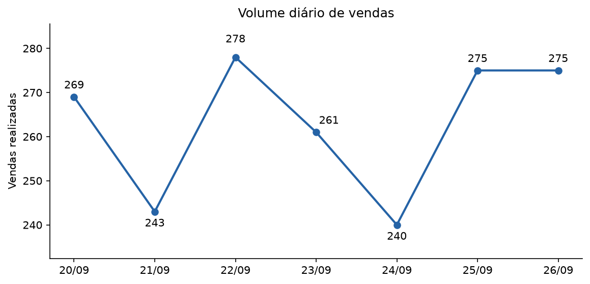
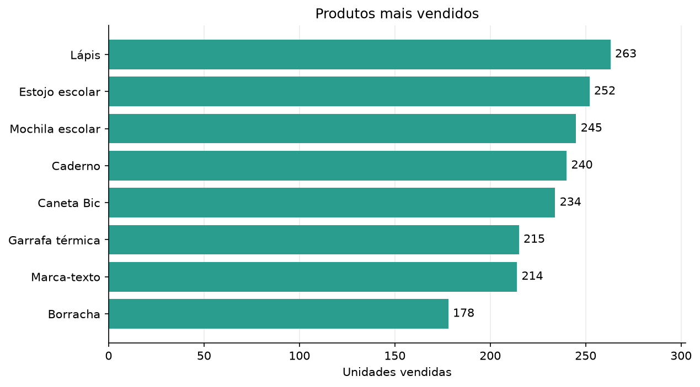
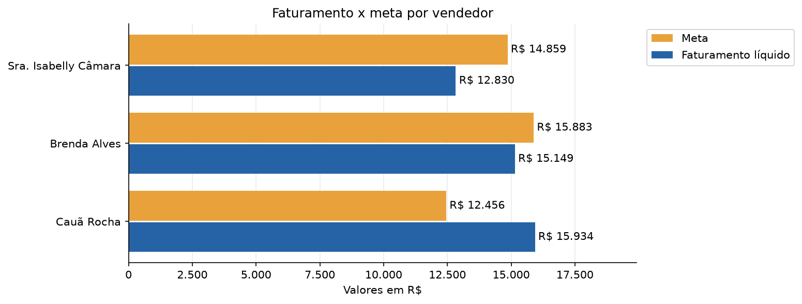
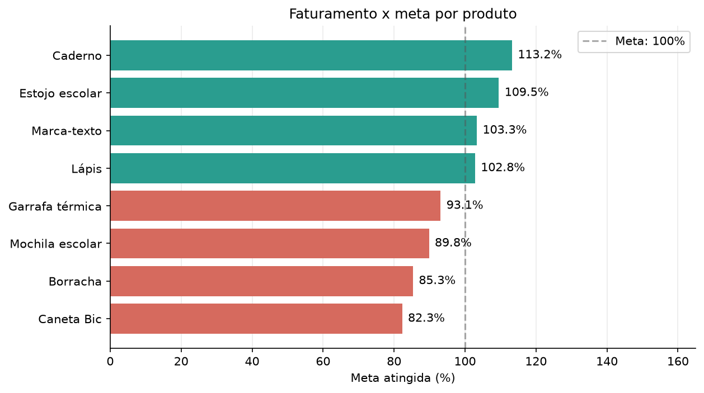

# Ranking de produtos

## Pergunta de negócio

> Quem vendeu, quanto vendeu, quem atingiu a meta e quais produtos precisam de atenção nos últimos sete dias?

## Dados simulados

`gerar_dados.py` cria uma planilha por dia em `dados/`, do sétimo dia anterior até D-1.
Cada arquivo tem as abas `Vendas`, `Vendedores` e `Produtos`. 
As metas de vendedores e produtos valem para todo o período e aparecem em cada arquivo diário; 
o resumo considera cada meta uma vez.

Os valores monetários estão em reais. O faturamento líquido corresponde ao faturamento bruto menos o desconto total.

## Resumo gerencial

`criar_planilha.py` lê os sete arquivos diários do período e salva `saidas/`, com a data da execução. 
Planilhas de períodos anteriores em `dados/` não entram no resumo.

| Aba          | Conteúdo                                                                                |
|--------------|-----------------------------------------------------------------------------------------|
| `Vendas`     | Todas as transações dos sete dias, da mais recente à mais antiga.                       |
| `Vendedores` | Faturamento líquido total de cada vendedor, meta, diferença e percentual atingido.      |
| `Produtos`   | Ranking por faturamento líquido, meta, diferença e percentual atingido de cada produto. |

## Gráficos

`gerar_grafico.py` lê o resumo gerencial do dia e salva quatro PNGs em `graficos/`:

| Arquivo                           | Análise                                                     |
|-----------------------------------|-------------------------------------------------------------|
| `volume_vendas.png`               | Evolução diária das unidades vendidas.                      |
| `produtos_mais_vendidos.png`      | Ranking de produtos por unidades vendidas.                  |
| `faturamento_meta_vendedores.png` | Faturamento líquido e meta de cada vendedor, em reais.      |
| `faturamento_meta_produtos.png`   | Percentual da meta atingido por produto, com valores em R$. |

Nos rótulos do gráfico de produtos, os valores em reais aparecem arredondados, na ordem faturamento/meta.

## Exemplos visuais

Os exemplos abaixo mostram os gráficos gerados pela automação para o período analisado.

### Volume diário de vendas



Mostra a quantidade total de unidades vendidas em cada dia, facilitando a comparação do movimento ao longo da semana.

### Produtos mais vendidos



Ordena os produtos pela quantidade vendida no período. As barras permitem identificar os itens com maior e menor volume.

### Faturamento e meta por vendedor



Compara, em reais, o faturamento líquido de cada vendedor com sua meta. Ajuda a ver quem atingiu ou ficou abaixo da meta.

### Atingimento de meta por produto



Apresenta o percentual da meta de faturamento atingido por produto. 

## Como executar

Na raiz do projeto:

```sh
uv run python src/analises/comercial/ranking_produtos/gerar_dados.py
uv run python src/analises/comercial/ranking_produtos/criar_planilha.py
uv run python src/analises/comercial/ranking_produtos/gerar_grafico.py
```
